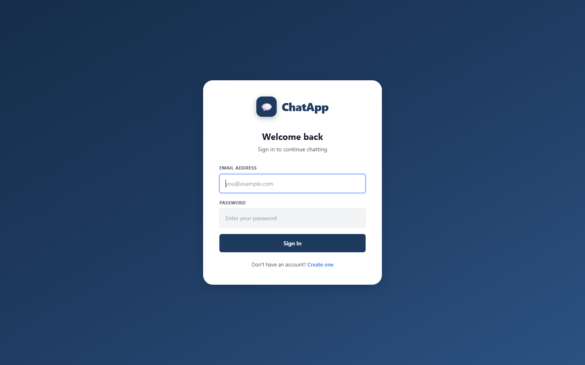
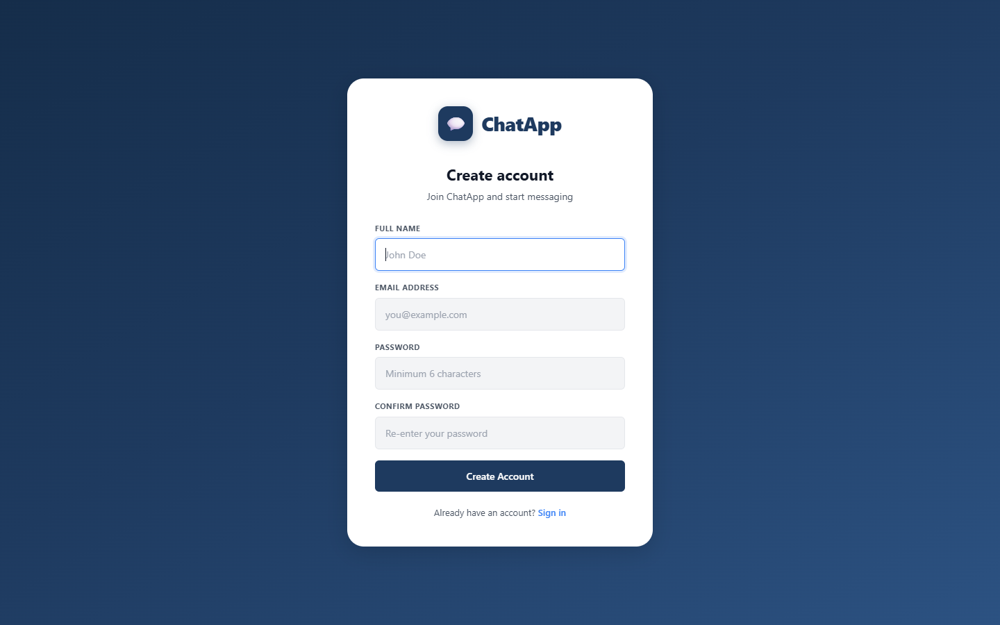
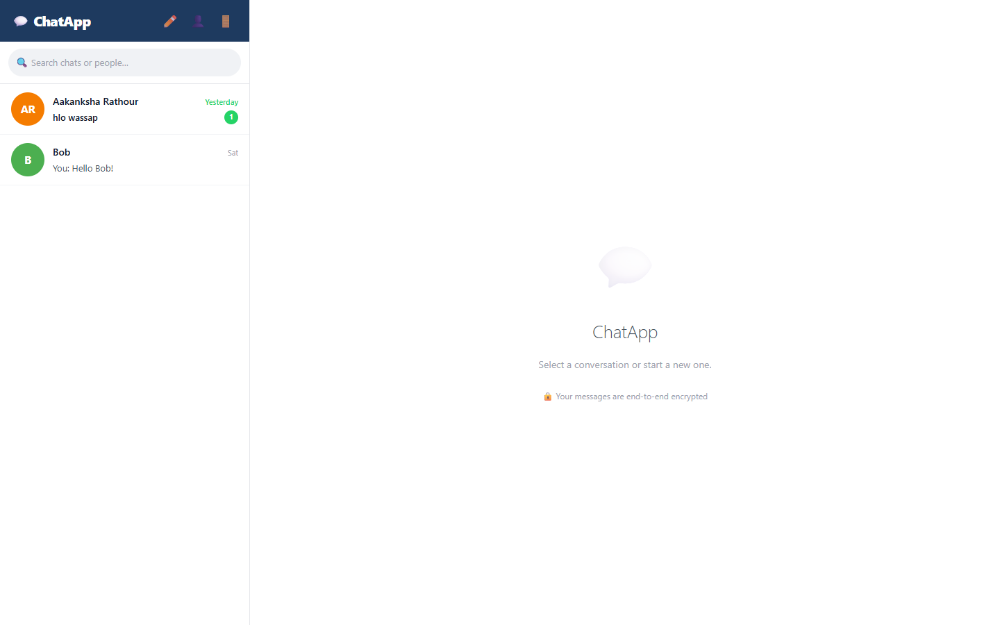
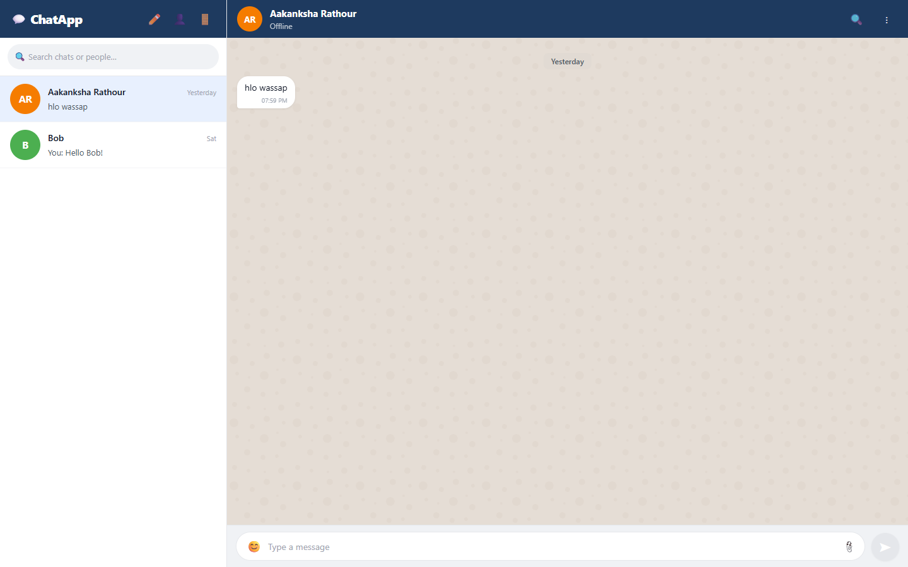
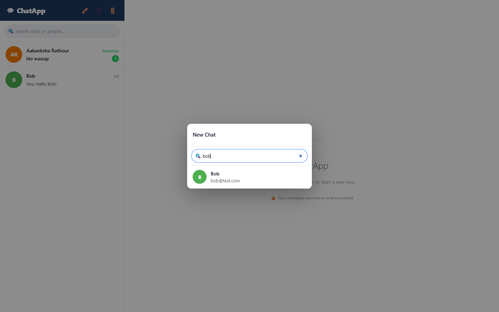
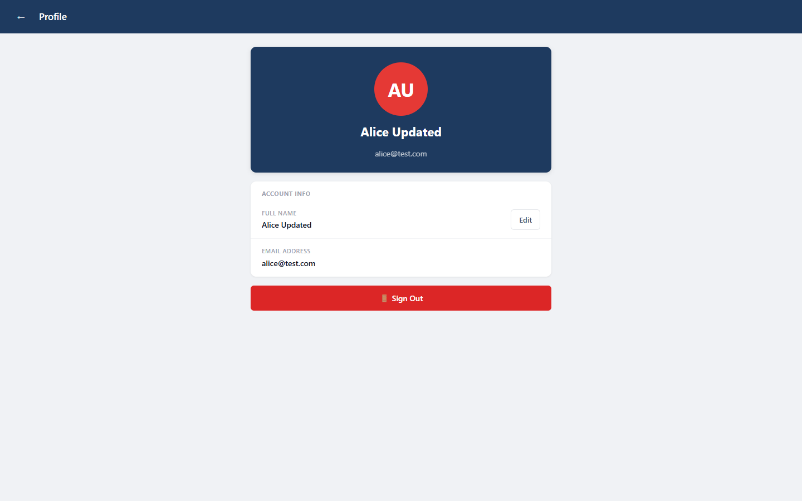

# 💬 ChatApp — Real-Time Chat Application

A full-stack real-time chat application built with **React** (frontend) and **Spring Boot** (backend), connected to **MongoDB Atlas** cloud database with **WebSocket** support for instant messaging.

## 🌐 Live Demo

| | URL |
|---|---|
| **Frontend** | https://chatapp-final.vercel.app |
| **Backend API** | https://vigilant-eagerness-production-7277.up.railway.app |

**Test account:** `alice@test.com` / `Test1234!`

---

## 📸 Screenshots

### Login Page


### Sign Up Page


### Chat List (Sidebar)


### Chat Window


### New Chat — Search Users


### User Profile


---

## ✨ Features

- **User Authentication** — Register & login with JWT tokens (24-hour session)
- **Real-Time Messaging** — Instant message delivery via WebSocket
- **User Search** — Search people by name or email directly from the sidebar
- **Chat Management** — Create new chats, view conversation history
- **File & Image Upload** — Send images, PDFs and other files (up to 10 MB)
- **Emoji Picker** — Built-in emoji support in the message input
- **Online Status** — See who is currently online via WebSocket presence
- **Unread Badge** — Unread message count per conversation
- **Profile Editing** — Update name and profile photo
- **Persistent Storage** — All messages & chats saved to MongoDB Atlas
- **Mobile Responsive** — Works on both desktop and mobile screens

---

## 🛠️ Tech Stack

### Frontend
| Technology | Purpose |
|---|---|
| React 18 | UI framework |
| Vite | Build tool & dev server |
| React Router v6 | Client-side routing |
| Context API | Auth state management |
| WebSocket (native) | Real-time communication |
| CSS (custom) | Styling |

### Backend
| Technology | Purpose |
|---|---|
| Spring Boot 3.4.5 | REST API framework |
| Spring Security | Authentication & authorization |
| Spring Data MongoDB | Database ORM |
| Spring WebSocket | Real-time messaging |
| JWT (jjwt 0.12.3) | Token-based auth |
| MongoDB Atlas | Cloud database |
| Java 17 | Runtime |
| Maven | Build tool |

---

## 📁 Project Structure

```
chat App final/
│
├── 📂 src/                          # React Frontend
│   ├── api/
│   │   └── client.js                # HTTP client with JWT handling
│   ├── components/
│   │   ├── Avatar.jsx               # User avatar with initials
│   │   ├── ChatView.jsx             # Message thread UI
│   │   └── EmojiPicker.jsx          # Emoji selector
│   ├── context/
│   │   └── AuthContext.jsx          # Auth state & API calls
│   ├── pages/
│   │   ├── LoginPage.jsx            # Login screen
│   │   ├── SignupPage.jsx           # Registration screen
│   │   ├── ChatListPage.jsx         # Main chat interface
│   │   └── ProfilePage.jsx          # User profile editor
│   ├── data/
│   │   └── mockData.js              # Date/time helper functions
│   ├── App.jsx                      # Routes & layout
│   └── index.css                    # Global styles
│
├── 📂 chatapp-backend/              # Spring Boot Backend
│   └── src/main/java/com/chatapp/
│       ├── config/                  # Security, CORS, MongoDB, WebSocket
│       ├── controller/              # REST API endpoints
│       ├── dto/                     # Request/Response objects
│       ├── model/                   # MongoDB documents
│       ├── repository/              # Database queries
│       ├── service/                 # Business logic
│       ├── websocket/               # WebSocket handler & auth
│       └── util/                    # JWT utility
│
├── 📂 screenshots/                  # App screenshots
└── README.md
```

---

## 🚀 Getting Started

### Prerequisites

| Tool | Version | Download |
|---|---|---|
| Java | 17 (LTS) | [Eclipse Adoptium](https://adoptium.net/) |
| Maven | 3.9+ | [maven.apache.org](https://maven.apache.org/) |
| Node.js | 18+ | [nodejs.org](https://nodejs.org/) |
| MongoDB Atlas | Free tier | [cloud.mongodb.com](https://cloud.mongodb.com/) |

---

### 1. Clone the Repository

```bash
git clone https://github.com/YOUR_USERNAME/chat-app-final.git
cd "chat App final"
```

---

### 2. MongoDB Atlas Setup

1. Create a free account at [cloud.mongodb.com](https://cloud.mongodb.com/)
2. Create a new **Project** and **Cluster** (free M0 tier)
3. In **Database Access** → Add a new database user with `Atlas Admin` role
4. In **Network Access** → Add IP `0.0.0.0/0` (allow all)
5. Click **Connect** → **Drivers** → copy the connection string

---

### 3. Configure the Backend

Edit `chatapp-backend/src/main/resources/application.properties`:

```properties
spring.data.mongodb.uri=mongodb+srv://<username>:<password>@<cluster>.mongodb.net/chatapp?appName=Cluster0
jwt.secret=YOUR_SECRET_KEY_MIN_32_CHARACTERS_LONG
jwt.expiration=86400000
```

Also update `chatapp-backend/src/main/java/com/chatapp/config/MongoConfig.java` line 47 with your connection URI.

---

### 4. Run the Backend

```bash
cd chatapp-backend
mvn spring-boot:run
```

Backend starts at → **http://localhost:8080**

---

### 5. Run the Frontend

Open a new terminal:

```bash
cd "chat App final"
npm install
npm run dev
```

Frontend starts at → **http://localhost:5173**

---

## 🔌 API Endpoints

### Auth
| Method | Endpoint | Description | Auth |
|---|---|---|---|
| POST | `/api/auth/register` | Create account | Public |
| POST | `/api/auth/login` | Login & get JWT token | Public |
| POST | `/api/auth/logout` | Logout | Required |

### Users
| Method | Endpoint | Description | Auth |
|---|---|---|---|
| GET | `/api/users/me` | Get my profile | Required |
| PUT | `/api/users/me` | Update name/photo | Required |
| GET | `/api/users/search?q=` | Search users by name/email | Required |

### Chats
| Method | Endpoint | Description | Auth |
|---|---|---|---|
| POST | `/api/chats` | Create or open a chat | Required |
| GET | `/api/chats` | Get all my chats | Required |
| GET | `/api/chats/:chatId` | Get single chat | Required |
| GET | `/api/chats/search?q=` | Search chats | Required |

### Messages
| Method | Endpoint | Description | Auth |
|---|---|---|---|
| GET | `/api/chats/:chatId/messages` | Get messages (paginated) | Required |
| POST | `/api/chats/:chatId/messages` | Send a message | Required |

### Upload
| Method | Endpoint | Description | Auth |
|---|---|---|---|
| POST | `/api/upload` | Upload file (multipart/form-data) | Required |

### WebSocket
| Protocol | Endpoint | Description |
|---|---|---|
| WS | `/ws/chat?token=JWT` | Real-time messaging connection |

---

## 🌐 WebSocket Events

**Server → Client:**
```json
{ "type": "new_message", "chatId": "...", "message": { ... } }
{ "type": "user_online",  "userId": "..." }
{ "type": "user_offline", "userId": "..." }
```

---

## 🔐 Environment & Security Notes

- JWT tokens expire after **24 hours**
- Passwords are hashed with **BCrypt**
- All protected routes require `Authorization: Bearer <token>` header
- CORS is configured for `http://localhost:5173`
- File uploads support: `jpg, png, gif, pdf, mp4, mp3, zip` (max 10 MB)

---

## 👤 Test Accounts

After running the project, you can register accounts or use these pre-created test accounts (password for all: `Test1234!`):

| Name | Email |
|---|---|
| Alice | alice@test.com |
| Bob | bob@test.com |
| Priya Sharma | priya@test.com |
| Rahul Verma | rahul@test.com |
| Ananya Singh | ananya@test.com |
| Arjun Patel | arjun@test.com |

---

## 🧑‍💻 Author

**Shantanu Rathor**  
GitHub: [@Aakanksharathour](https://github.com/Aakanksharathour)

---

## 📄 License

This project is for educational purposes.
